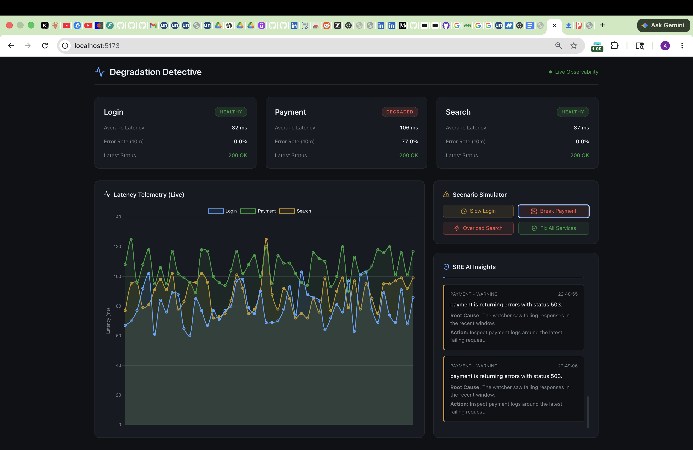

# Degradation Detective

Real-time API health monitor with anomaly detection and AI narration. Built as a 34-day observability project.



## Architecture

Degradation Detective starts with three fake services: `login`, `payment`, and `search`. They run in FastAPI and can be switched into healthy, slow, error, or combined chaos modes.

The watcher polls those services every two seconds, records status codes and latency, and saves every ping to SQLite. The same FastAPI app exposes historical and summary metrics so later dashboard work can read from a stable JSON API.

The detector layer reads recent metrics from SQLite, calculates a rolling baseline, flags latency, error, and degrading-pattern anomalies, and classifies whether an incident is isolated to one service or correlated across multiple services.

Active anomalies become alerts with deduplication, a 30-second cooldown, and automatic resolution once a service recovers. New unresolved alerts are passed to the narrator loop, which asks OpenRouter for a JSON-only SRE explanation when `OPENROUTER_API_KEY` is available and falls back to local templates when it is not.

## Backend Commands

Install dependencies:

```bash
python -m venv venv
source venv/bin/activate
pip install -r backend/requirements.txt
```

Run the fake services and metrics API:

```bash
uvicorn backend.fake_services:app --reload
```

Run the watcher in a second terminal:

```bash
python backend/watcher.py
```

Print detector baselines and current anomalies:

```bash
python backend/detector.py
```

Run the narrator once for unresolved alerts:

```bash
python backend/narrator.py
```

Optional voice output is available for local experiments by installing `pyttsx3` and setting `ENABLE_TTS=1`. The main pipeline does not require TTS.

## API Endpoints

- `GET /login`, `GET /payment`, `GET /search`
- `POST /admin/chaos`
- `POST /admin/chaos/reset`
- `GET /admin/status`
- `GET /metrics/history?service=login&minutes=10`
- `GET /metrics/summary?minutes=10`
- `GET /alerts/active`
- `GET /alerts/history?limit=50`
- `GET /narrations/recent?limit=20`

## Tech Stack
- **Backend**: FastAPI, SQLite, Pydantic, Python
- **Frontend**: React, Vite, Chart.js, Lucide Icons, Vanilla CSS
- **AI Integration**: OpenRouter API (GPT-4o-mini)
- **Monitoring Architecture**: 2-second polling watcher, 10-minute rolling baseline anomaly detection.

## Frontend Commands

From the `frontend` directory:

```bash
cd frontend
npm install
npm run dev
```
Open `http://localhost:5173` to see the live dashboard!

## Deployment Links
- [🚀 Live Dashboard](https://degradation-detective.vercel.app) — deployed on Vercel
- [📦 Source Code](https://github.com/akshat-dubey-03/Degradation-Detective) — GitHub Repository
- [🎬 Demo Video](#) (Coming Soon)
- Backend: deployable via Render (local for now — see Backend Commands above)
